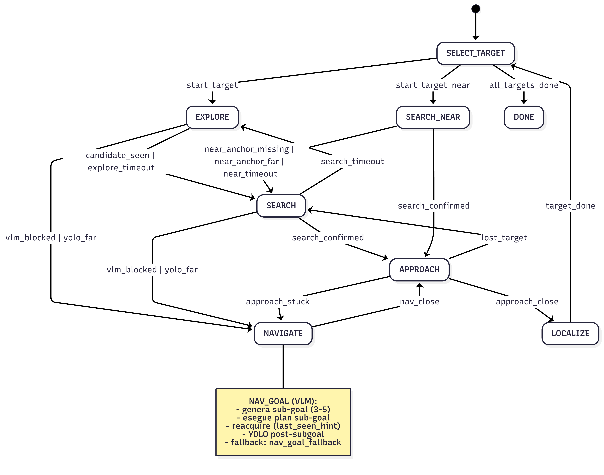

# Scopo
Pipeline modulare per AI2-THOR con planning (Gemma 3), navigazione guidata da VLM, detection YOLO e telemetria frame-by-frame.

# Moduli
- `pipeline_subgoal.py`: orchestratore (CLI + ciclo percezione/azione).
- `pipeline_modules/utils.py`: parsing, normalizzazione, json, IoU.
- `pipeline_modules/sensors.py`: stato robot e distanze da depth.
- `pipeline_modules/memory.py`: exploration memory e summary.
- `pipeline_modules/action_manager.py`: safety, anti-loop e macro-azioni.
- `pipeline_modules/vlm.py`: planner, navigazione VLM, bbox annotator.
- `pipeline_modules/yolo.py`: detection YOLO (bbox/centroide/maschera).
- `pipeline_modules/visualization.py`: overlay telemetria e frame evidenze.
- `pipeline_modules/object_memory.py`: memoria spaziale oggetti (short/long-term).

# FSM


## Panoramica
La pipeline e' guidata da una FSM (Finite State Machine) che governa tutte le fasi del ciclo
per ogni target: selezione target -> esplorazione -> ricerca -> navigazione -> approccio -> localizzazione.
Le transizioni sono basate su segnali misurabili (YOLO, probe VLM, distanze, timeout, stuck) e
le azioni sono filtrate dall'ActionManager per sicurezza e anti-loop.

## Stati e fasi (con logica di transizione)
- **SELECT_TARGET**: sceglie il prossimo target dalla coda creata da `build_target_queue`.
  - Se il goal contiene una relazione "near/vicino", la coda crea prima la reference (mode=global)
    e poi il target in mode=near; in questo caso si entra in **SEARCH_NEAR**.
  - Se non ci sono target rimanenti, transizione a **DONE**.
- **EXPLORE**: macro-scan per aumentare coverage e avanzare in sicurezza.
  - Azioni: `apply_explore_macros` mette in coda scan/advance in base a coverage e distanze.
  - Uscite: `candidate_seen=True` (probe positivo o detection low-conf) -> **SEARCH**;
    timeout `state_steps >= max_explore_steps` -> **SEARCH**.
- **SEARCH**: ricerca attiva del target con scan piu' frequenti e YOLO.
  - Conferma: `search_hits` usa `confirmed_from_hits(k/n)`; se confermato -> **APPROACH**.
  - Timeout `state_steps >= max_search_steps` -> **EXPLORE**.
- **SEARCH_NEAR**: ricerca locale attorno alla reference (mode=near).
  - Se anchor mancante o troppo lontana (`anchor_dist > near_radius`) -> **SEARCH**.
  - Se `search_confirmed` -> **APPROACH**.
  - Timeout `state_steps >= near_max_steps` -> **SEARCH**.
- **NAVIGATE**: raggiunge target distante/occluso con piani VLM o fallback.
  - Genera piani (`nav_plan` o `nav_subgoals`) via VLM, parsati con `parse_nav_plan/subgoals`.
  - Se non c'e' progresso (`nav_no_progress_steps`) forza replan.
  - Transizione a **APPROACH** quando c'e' detection recente e distanza <= `approach_dist_thresh_m`.
- **APPROACH**: avvicinamento e centraggio target.
  - Se `oracle_approach` attivo: usa metadata/mask (`oracle_approach_step`).
  - Altrimenti: `compute_approach_action` integra sensor, bbox, distanze e recovery.
  - Uscite: `close_enough` -> **LOCALIZE**; `approach_stuck_steps >= nav_stuck_steps` -> **NAVIGATE**;
    `lost_target` (nessuna detection da `lost_target_frames`) -> **SEARCH**.
- **LOCALIZE**: stabilizza la detection e salva evidenze.
  - Conferma: `localize_hits` con `confirmed_from_hits(k/n)` -> target completato -> **SELECT_TARGET**.
  - Timeout `state_steps >= max_localize_steps` -> **SEARCH**.
- **DONE/FAIL**: DONE quando la coda target e' esaurita. FAIL implicito a fine run se mancano target
  (salvato in `detection.json` con `success=false`).

## Logica di decisione azioni (priorita e safety)
1. **Azioni forzate**: in **APPROACH** la logica approccio (oracle o non-oracle) produce una `forced_action`
   che bypassa l'ActionManager.
2. **Azioni di navigazione**: in **NAVIGATE** si eseguono piani VLM (deque) o fallback basati su memoria.
3. **Hint/last_seen**: gli hint di probe o YOLO (left/center/right) possono generare rotazioni guidate.
4. **VLM choose_action**: se non ci sono azioni forti, la VLM propone un'azione singola.
5. **ActionManager**: applica safety (distanze, collisioni), evita inversi e oscillazioni,
   e inserisce macro-scan/advance quando utile.

## Logica di detection e segnali
- **Probe VLM**: ogni `probe_every` step (fuori da APPROACH) valuta visibilita' target e fornisce hint.
- **YOLO** e' invocato quando:
  - richiesto dalla VLM (`request_yolo`), o
  - confidenza VLM >= `target_conf_thresh`, o
  - probe positivo, o
  - stato SEARCH/SEARCH_NEAR/LOCALIZE, o
  - tick periodico `yolo_every`, o
  - in NAVIGATE al termine di reacquire/scan.
- Le detection aggiornano `object_memory`, `last_detection` e triggerano conferme `search/localize`.

# Esecuzione
Esempio base:
```
python PiPeline-SubGoal/pipeline_subgoal.py --goal "Cercami la mela" --scene FloorPlan1
```

Output salvati in:
- `PiPeline-SubGoal/outputs/frames/`
- `PiPeline-SubGoal/outputs/debug/`
- `PiPeline-SubGoal/outputs/plan.json`
- `PiPeline-SubGoal/outputs/run_log.json`
- `PiPeline-SubGoal/outputs/detection.json`

# Note operative
- YOLO e' invocato ad ogni step per default (`--yolo_every 1`).
- Depth e' abilitato di default per stimare distanze di prossimita'.
- Dopo detection, la pipeline entra in modalita' APPROACH finche' soddisfa la soglia di distanza o area bbox.
- Memoria long-term salvata in `PiPeline-SubGoal/outputs/long_term_memory.json`.
