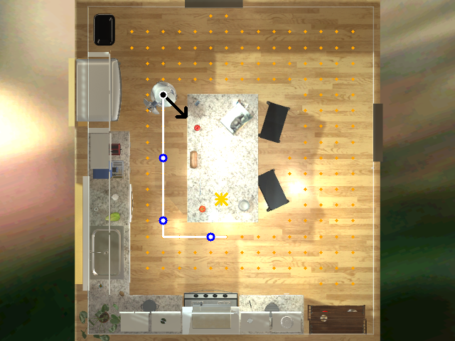

# Documentazione dati di oggi

Data: 2025-01-16

## Obiettivo della sessione
Creare una pipeline di navigazione piu' robusta per il robot, combinando:
- visione ego (camera del robot),
- mappa top-down con punti navigabili,
- percorso calcolato in Python con checkpoint visivi,
- prompt VLM aggiornato per incrociare mappa + ego-view.

## Risultati principali (in breve)
1) Mappa top-down con punti arancioni e percorso bianco (pathfinding).
2) Checkpoint blu lungo il percorso per guidare i subgoal.
3) Prompt VLM aggiornato per usare due immagini (ego + topdown).
4) Token max alzati per gestire reasoning piu' lungo.
5) Debug frame salvati per mappa e visione ego.

## 1) Percorso su mappa top-down (pathfinding)
Scelta chiave: togliere il carico di pianificazione alla VLM.
La VLM non deve calcolare il percorso: lo fa Python sul grafo dei punti raggiungibili.
La VLM legge la linea bianca e segue la direzione, controllando con la ego-view.

Immagine esempio (mappa con percorso):


Ragionamento:
- Calcolo del path in Python (grafo + shortest path).
- Disegno della linea bianca sulla mappa.
- Inserimento checkpoint blu a distanza regolare per subgoal.
- La VLM usa il checkpoint piu' vicino come obiettivo immediato.

Decisione futura:
- Generare un secondo percorso alternativo che evita zone con molti ostacoli.
- Se due percorsi simili esistono, scegliere quello con minore densita' di oggetti.

## 2) Evoluzione della mappa top-down (progressivo miglioramento)
L'overlay e' stato raffinato in piu' fasi:

1. Prima versione (topdown_reachable3.png)


2. Versione intermedia (topdown_reachable2.png)


3. Versione finale (topdown_reachable.png)


Evoluzione:
- Densita' dei punti piu' alta.
- Leggibilita' migliorata con colori stabili.
- Freccia robot distinta dai punti.
- Checkpoint blu e target ★ come indicatori espliciti.

## 3) Prompt VLM: doppia immagine e logica incrociata
Scelta: la VLM riceve due immagini e deve fare cross-reference.
La mappa serve per la direzione, l'ego-view serve per la sicurezza.

Estratto prompt (pipeline_modules/vlm_prompts.py):
```py
SYSTEM_INSTRUCTIONS = (
    "YOU ARE A DUAL-VIEW ROBOT NAVIGATOR. "
    "You receive two images: (1) [EGO-VIEW] robot view, (2) [TOP-DOWN MAP] tactical map. "
    "On the top-down map: orange points are safe/reachable; everything else is lava/wall. "
    "A black arrow shows robot position and facing; a gold star (★) marks the target if present. "
    "If the robot is not on orange, prioritize returning to orange. "
)

NAVIGATION_LOGIC = (
    "NAVIGATION LOGIC:\n"
    "1. FOLLOW GUIDANCE (MAP): Look for a WHITE LINE on the map. This is your calculated GPS path. "
    "Follow the white line strictly. If no white line, follow the ORANGE dots towards the STAR.\n"
    "Blue circles on the white line are CHECKPOINTS: use the nearest one as your current subgoal.\n"
    "2. SAFETY CHECK (EGO-VIEW): Before moving, verify with your eyes (Ego-View). "
    "Is the path physically clear? If you see an immediate obstacle (e.g., table edge) that the map missed, STOP or detour.\n"
    "3. TARGET ACQUISITION: If the Target Object is clearly visible in EGO-VIEW (not just as a Star on the map), "
    "ignore the white line and approach the target directly to center it."
)
```

Effetto:
- La VLM segue il percorso gia' calcolato.
- Usa la vista ego solo per evitare collisioni reali.
- Quando vede il target dal vivo, interrompe la logica mappa.

## 4) Aumento max token per reasoning
Per evitare limiti di output e migliorare la stabilita' del reasoning:

Estratto (pipeline_modules/vlm.py):
```py
def _generate(self, inputs, max_new_tokens: int = 768) -> str:
    ...

def plan_navigation_subgoals(...):
    ...
    text = self._generate(inputs, max_new_tokens=4096)
```

Motivazione:
- Stiamo passando contesto piu' ricco (mappa + ego + history).
- Il modello necessita piu' token per mantenere coerenza.

## 5) Debug e tracciamento
Ogni step genera:
- `step_XXXX.png` (ego-view)
- `map_step_XXXX.png` (topdown map)

Questo aiuta a capire cosa vede la VLM e perche' prende certe azioni.

## 6) Direzione futura
1) Secondo percorso alternativo che penalizza zone con ostacoli.
2) Scoring del path in base a densita' oggetti (da metadata o YOLO).
3) Agganciare la pianificazione a un "costo ambiente" per percorsi piu' puliti.

---

File chiave:
- `Tirocinio/PiPeline-SubGoal/pipeline_modules/runner.py` (pathfinding + topdown + debug)
- `Tirocinio/PiPeline-SubGoal/pipeline_modules/vlm_prompts.py` (prompt dual-view)
- `Tirocinio/PiPeline-SubGoal/pipeline_modules/vlm.py` (max_new_tokens)
