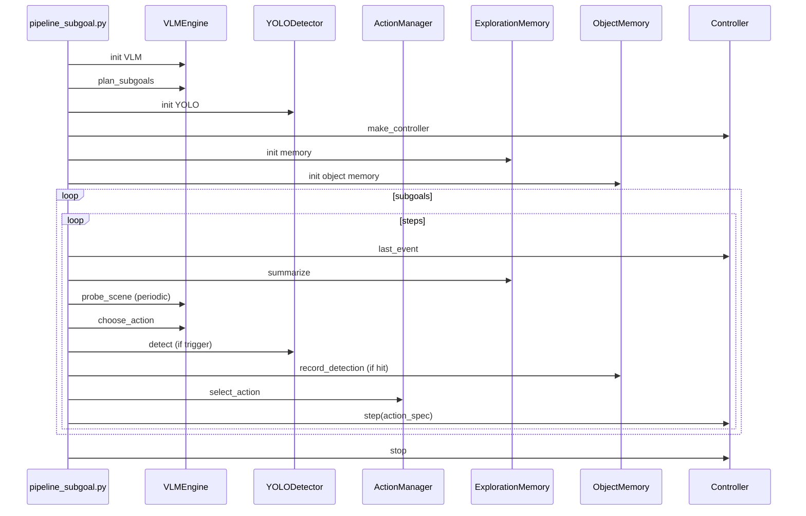
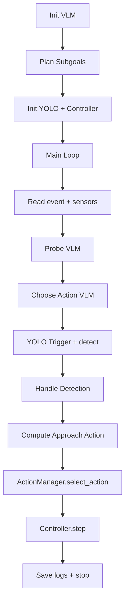

# PiPeline-SubGoal Sequence + Code Snippets (VS Code)

This document pairs a Mermaid sequence overview with code snippets. The flowchart below has clickable nodes that jump to code sections.

## Sequence Diagram (overview)


## Clickable Code Map (flowchart)


## Code Snippets

### code-vlm-init
<details>
<summary>VLM init (PiPeline-SubGoal/pipeline_subgoal.py:110-116)</summary>

```py
vlm = None
if not args.no_vlm:
    try:
        vlm = VLMEngine(args.vlm_model, action_set=ACTION_SET)
    except Exception as e:
        print_warn(f"VLM load failed, fallback planner/action. Err={e}")
        vlm = None
```
</details>

### code-plan-subgoals
<details>
<summary>Plan subgoals + fallback (PiPeline-SubGoal/pipeline_subgoal.py:118-129)</summary>

```py
plan = None
if vlm is not None and args.goal:
    try:
        plan = vlm.plan_subgoals(args.goal)
    except Exception as e:
        print_warn(f"Plan failed, fallback. Err={e}")
        plan = None
if not plan or "subgoals" not in plan:
    plan = fallback_plan(args.goal or "", args.target_type)
if args.target_type:
    plan["target_type"] = args.target_type
target_type = plan.get("target_type") or guess_target_from_goal(args.goal) or "Apple"
```
</details>

### code-init-core
<details>
<summary>Init YOLO + Controller + memories (PiPeline-SubGoal/pipeline_subgoal.py:137-156)</summary>

```py
detector = YOLODetector(args.yolo_model, args.yolo_conf, args.imgsz, target_type)

cfg = EnvConfig(scene=args.scene, render_depth=True, render_instance_segmentation=False)
controller = make_controller(cfg)

episode_id = str(int(time.time()))
object_memory = ObjectMemory(run_dir / "long_term_memory.json", scene_id=args.scene, episode_id=episode_id)

dir_bins = max(4, int(round(360 / float(args.scan_degrees))))
memory = ExplorationMemory(cell_size=args.cell_size, dir_bins=dir_bins)
action_mgr = ActionManager(
    safe_front_m=args.safe_front_m,
    scan_degrees=args.scan_degrees,
    scan_trigger=args.scan_trigger,
    scan_cooldown=args.scan_cooldown,
    advance_steps=args.advance_steps,
    advance_min_front=args.advance_min_front,
)
```
</details>

### code-read-sensors
<details>
<summary>Read event + sensors (PiPeline-SubGoal/pipeline_subgoal.py:337-341)</summary>

```py
event = controller.last_event
frame_rgb = event.frame
frame_bgr = get_rgb_bgr(event)
sensor = build_sensor_state(event, depth_radius=args.depth_radius)
mem_summary = memory.summarize(sensor["position"], sensor["yaw"], sensor)
```
</details>

### code-probe-vlm
<details>
<summary>Probe VLM + enqueue scan (PiPeline-SubGoal/pipeline_subgoal.py:351-367)</summary>

```py
if vlm is not None and int(args.probe_every) > 0 and total_steps % int(args.probe_every) == 0:
    img = Image.fromarray(frame_rgb)
    probe_info, probe_raw = vlm.probe_scene(img, target_type)
    if isinstance(probe_info, dict):
        try:
            conf = int(probe_info.get("confidence", 0) or 0)
        except Exception:
            conf = 0
        visible = bool(probe_info.get("target_visible", False))
        probe_positive = visible or conf >= int(args.probe_conf_thresh)
        if probe_positive:
            action_mgr.enqueue_probe_scan(
                steps=int(args.probe_scan_steps),
                degrees=int(args.probe_scan_degrees),
                step=total_steps,
            )
```
</details>

### code-choose-action
<details>
<summary>VLM choose_action (PiPeline-SubGoal/pipeline_subgoal.py:389-429)</summary>

```py
if vlm is not None:
    context_summary = {
        "episode_context": {
            "scene_id": args.scene,
            "step_id": total_steps,
            "current_subgoal": current_subgoal,
        },
        "sensor": {
            "dist_front_m": round(sensor["dist_front_m"], 2),
            "dist_left_m": round(sensor["dist_left_m"], 2),
            "dist_right_m": round(sensor["dist_right_m"], 2),
            "collision": bool(sensor["collision"]),
            "last_action_success": bool(sensor["last_action_success"]),
            "pose_discrete": mem_summary.get("pose_discrete", {}),
        },
        "memory": {
            "visited": mem_summary["visited"],
            "coverage_pct": mem_summary["coverage_pct"],
            "ranked_directions": mem_summary["ranked_directions"],
            "novelty_score": mem_summary["novelty_score"],
        },
        "approach_state": {
            "active": approach_active,
            "last_detection_step": last_detection["step"] if last_detection else None,
        },
        "object_memory": object_summary,
        "long_term_priors": long_term_priors,
        "constraints": {"safe_front_m": round(float(args.safe_front_m), 2)},
    }
    img = Image.fromarray(frame_rgb)
    action_data = vlm.choose_action(img, sg_desc, history, context_summary)
```
</details>

### code-yolo-trigger
<details>
<summary>YOLO trigger + call (PiPeline-SubGoal/pipeline_subgoal.py:430-445)</summary>

```py
if yolo_res is None and yolo_reason and total_steps - last_yolo_step >= int(args.yolo_cooldown):
    yolo_res = try_yolo(frame_rgb, frame_bgr, yolo_reason)
    if yolo_res:
        handle_detection(event, yolo_res)
        object_summary = object_memory.get_summary(target_type)
        long_term_priors = object_memory.get_long_term_priors(target_type)
```
</details>

### code-yolo-try
<details>
<summary>YOLO detect (PiPeline-SubGoal/pipeline_subgoal.py:175-240)</summary>

```py
det, mask01 = detector.detect(frame_rgb)
last_yolo_step = total_steps
if det is None:
    return None
if det["score"] < float(args.yolo_conf):
    return None
...
safe_write_json(run_dir / "detection.json", det_out)
...
if vlm is not None and not args.no_vlm_bbox:
    img = Image.fromarray(frame_rgb)
    vlm_bbox, vlm_raw = vlm.predict_bbox(img, target_type)
```
</details>

### code-handle-detection
<details>
<summary>Handle detection + memory (PiPeline-SubGoal/pipeline_subgoal.py:243-273)</summary>

```py
det = yolo_res["det"]
centroid = det["centroid_px"]
world = estimate_target_world(event, target_type, centroid, depth_radius=args.depth_radius)
if world:
    object_memory.record_detection(
        target_type,
        world["position"],
        total_steps,
        det["score"],
        centroid_px=centroid,
        source=world.get("source", "unknown"),
    )
    yolo_res["state"]["world_position"] = world["position"]
    yolo_res["state"]["world_source"] = world.get("source", "unknown")
    safe_write_json(run_dir / "detection.json", yolo_res["state"])
...
last_detection = {"det": det, "world": world, "step": total_steps}
approach_active = True
```
</details>

### code-approach-action
<details>
<summary>Approach controller (PiPeline-SubGoal/pipeline_subgoal.py:284-325)</summary>

```py
cx = int(det["centroid_px"][0])
center_x = int(w / 2)
err = cx - center_x
if abs(err) > int(args.approach_center_tol_px):
    direction = "RotateRight" if err > 0 else "RotateLeft"
    return {"action": direction, "degrees": int(args.approach_rotate_degrees)}

world = estimate_target_world(event, target_type, det["centroid_px"], depth_radius=args.depth_radius)
...
if close_enough:
    approach_confirm += 1
    if approach_confirm >= int(args.approach_confirm_k):
        found = {...}
    return {"action": "Done"}
return {"action": "MoveAhead"}
```
</details>

### code-action-select
<details>
<summary>ActionManager.select_action (PiPeline-SubGoal/pipeline_subgoal.py:455-459)</summary>

```py
action_spec, decision, scan_completed = action_mgr.select_action(
    forced_action if forced_action else action,
    sensor,
    total_steps,
)
```
</details>

### code-controller-step
<details>
<summary>Controller step + update (PiPeline-SubGoal/pipeline_subgoal.py:491-499)</summary>

```py
next_event = controller.step(**action_spec)
post_bgr = get_rgb_bgr(next_event)
post_sensor = build_sensor_state(next_event, depth_radius=args.depth_radius)
memory.update(post_sensor["position"], post_sensor["yaw"])
post_mem = memory.summarize(post_sensor["position"], post_sensor["yaw"], post_sensor)
```
</details>

### code-shutdown
<details>
<summary>Stop + save logs (PiPeline-SubGoal/pipeline_subgoal.py:534-558)</summary>

```py
controller.stop()

safe_write_json(run_dir / "run_log.json", log)
if found is None:
    ...
else:
    ...
```
</details>

### code-vlm-def
<details>
<summary>VLM methods (PiPeline-SubGoal/pipeline_modules/vlm.py:33-78)</summary>

```py
def plan_subgoals(self, goal_text: str):
    system = (
        "You are a planner for an AI2-THOR robot. "
        "Return JSON only with keys: target_type, subgoals. "
        "subgoals is a list of objects {id, type, description}."
    )
    ...
    return extract_json_anywhere(text)

def choose_action(self, image: Image.Image, subgoal_desc: str, history, context_summary: Dict):
    system = (
        "You control a robot in AI2-THOR. "
        "Pick exactly one action from: "
        + ", ".join(self.action_set)
        + ". Return JSON only: "
        "{\"action\": \"...\", \"reason\": \"short\", \"target_confidence\": 0.0-1.0, \"request_yolo\": true|false}."
    )
    ...
    return extract_json_anywhere(text)
```
</details>

### code-yolo-def
<details>
<summary>YOLO detect (PiPeline-SubGoal/pipeline_modules/yolo.py:7-69)</summary>

```py
class YOLODetector:
    def __init__(self, model_path: str, conf: float, imgsz: int, target_label: str):
        ...
    def detect(self, frame_rgb: np.ndarray):
        results = self.model.predict(source=frame_rgb, conf=self.conf, imgsz=self.imgsz, verbose=False)
        ...
        return det, mask01
```
</details>

### code-action-manager-def
<details>
<summary>ActionManager.select_action (PiPeline-SubGoal/pipeline_modules/action_manager.py:90-135)</summary>

```py
def select_action(
    self, candidate_action: Optional[object], sensor: Dict, step: int
) -> Tuple[Dict, Dict, bool]:
    overrides = []
    source = "vlm" if candidate_action else "rule"
    ...
```
</details>

### code-memory-def
<details>
<summary>ExplorationMemory.summarize (PiPeline-SubGoal/pipeline_modules/memory.py:69-99)</summary>

```py
def summarize(self, pos: Dict, yaw: float, sensor: Dict) -> Dict:
    key = self.cell_key(pos)
    visited = key in self.cells
    coverage_ratio = self.coverage_ratio(key)
    ...
    return {
        "pose_discrete": {"cell": {"x": key[0], "z": key[1]}, "dir_idx": int(current_dir)},
        "visited": bool(visited),
        ...
    }
```
</details>
